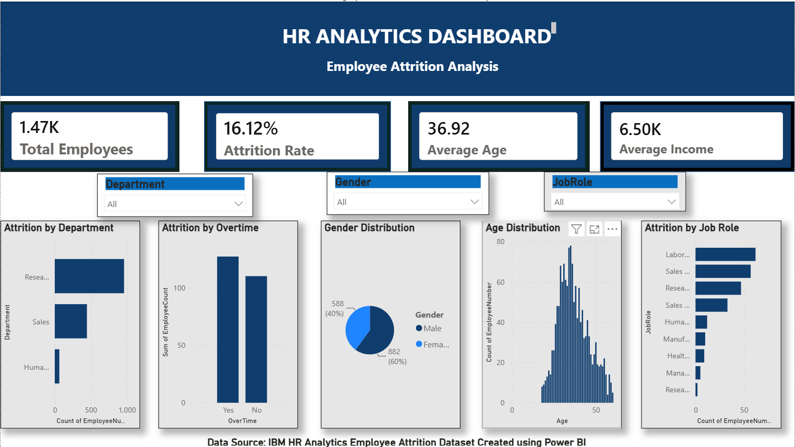

 HR Analytics Dashboard

 Overview
An interactive HR Analytics Dashboard built using Power BI to analyze employee attrition patterns, workforce demographics, and employee behavior.

Dashboard Preview

 Key Metrics
- Total Employees: 1,470
- Attrition Rate: 16.12%
- Average Age: 36.92
- Average Income: 6.50K

 Features
- Department-wise Employee Analysis
- Gender Distribution Analysis
- Attrition by Overtime
- Age Distribution
- Attrition by Job Role
- Interactive Filters (Department, Gender, Job Role)

 Tools & Technologies
- Power BI Desktop
- DAX Measures
- Data Visualization
- IBM HR Analytics Employee Attrition Dataset

Insights
- Research & Development has the highest employee count.
- Attrition rate stands at 16.12%.
- Employees working overtime show higher attrition.
- Most employees belong to the 30–45 age group.
  
 Author
Sri Raman D
